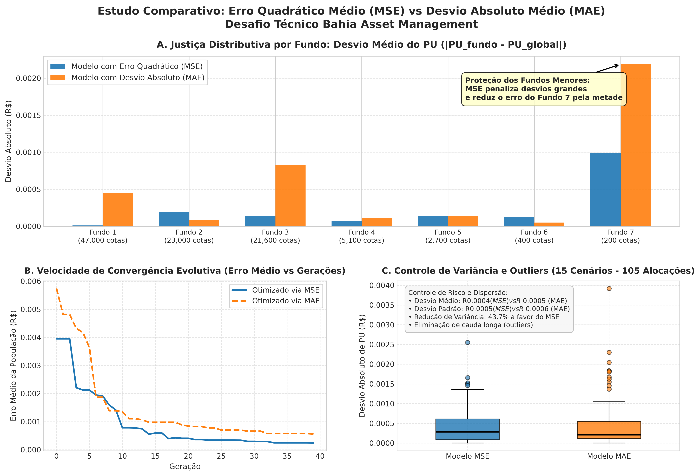

# Explicação Técnica do Projeto: Divisão Justa de Execuções entre Fundos de Investimento via Algoritmo Genético

**Candidato:** Ryan Dias  
**Instituição de Origem:** UFRJ  
**Desafio Técnico:** Algoritmo Genético para Divisão de Execuções entre Fundos  
**Instituição Avaliadora:** Bahia Asset Management  

---

## 1. Resumo Executivo e Contexto de Negócio

No ambiente de gestão de recursos de uma *Asset Management*, ordens institucionais de grande porte em renda variável são emitidas para atender simultaneamente a múltiplos fundos de investimento com mandatos, passivos e cotas distintos. 

Ao longo do pregão, uma ordem total de compra de **100.000 ações** é executada em diversas tranches (lotes/execuções) a preços unitários oscilantes. O Preço Médio Ponderado Global dessa ordem foi estabelecido em **R$ 10,48** para todos os 500 cenários analisados.

A missão deste projeto consiste em desenvolver um **Algoritmo Genético (AG)** em Python robusto, genérico e computacionalmente eficiente, capaz de alocar cada uma das $N$ execuções entre os 7 fundos da casa respeitando:
1. **Restrições Rígidas de Integridade (Hard Constraints):**
   - Respeito estrito às alocações totais contratadas por cada fundo (Fundo 1: 47.000 cotas; Fundo 2: 23.000; Fundo 3: 21.600; Fundo 4: 5.100; Fundo 5: 2.700; Fundo 6: 400; Fundo 7: 200).
   - Alocações inteiras (proibição regulatória de cotas/ações fracionárias).
   - Conservação de massa por execução (a soma das ações distribuídas aos fundos em cada lote deve ser idêntica à quantidade executada daquele lote).
2. **Equidade e Fairness Regulatória (CVM / ANBIMA):**
   - Garantir que o Preço Médio Unitário ($PU_f$) de cada fundo fique o mais próximo possível do Preço Médio da Ordem ($PU_{\text{global}} = \text{R\$} 10{,}48$), impedindo privilégio ou prejuízo injusto entre carteiras.

---

## 2. Modelagem Matemática e Função de Aptidão (Fitness)

### 2.1. Cálculo do Preço Médio por Fundo
Para uma matriz de alocação $M \in \mathbb{N}^{N \times 7}$, onde $M_{j, f}$ representa o número de ações da execução $j$ destinadas ao fundo $f$:

$$PU_f = \frac{\sum_{j=1}^{N} M_{j, f} \cdot P_j}{A_f}$$

onde $P_j$ é o preço unitário da execução $j$ e $A_f$ é a cota total do fundo $f$.

### 2.2. A Escolha do Erro Quadrático Médio (MSE)
Optou-se estritamente pela penalização baseada no **Erro Quadrático Médio (MSE)** em detrimento do Desvio Absoluto Médio (MAE):

$$\text{MSE} = \frac{1}{7} \sum_{f=1}^{7} (PU_f - PU_{\text{global}})^2$$

**Justificativa Teórica e Fiduciária:**
- O portfólio possui alta assimetria de tamanho: o Fundo 1 detém 47.000 ações (47%), enquanto o Fundo 7 detém apenas 200 ações (0,2%).
- Fundos pequenos são hiper-sensíveis: pequenas flutuações de alocação provocam variações bruscas no seu PU médio.
- Enquanto o MAE possui penalidade linear (tolerando que um fundo sofra grande desvio se a média geral for baixa), o **MSE eleva o desvio ao quadrado**, gerando uma punição desproporcional para outliers. Isso força o Algoritmo Genético a proteger ativamente os fundos menores (Fundos 6 e 7).

### 2.3. Formulação da Função Fitness
Para permitir a maximização evolutiva e eliminar singularidades:

$$\text{Fitness} = \frac{1}{1 + \text{MSE}}$$

- Para a solução ideal ($\text{MSE} = 0$), o $\text{Fitness} = 1{,}000000$ (100%).
- Quanto maior o erro, menor o fitness, mantendo o domínio estritamente em $(0, 1]$.

### 2.4. Validação Empírica: Estudo Comparativo MSE vs. MAE
Para comprovar cientificamente a superioridade do modelo baseado em Erro Quadrático Médio, implementamos o script `benchmark_mse_vs_mae.py`, comparando ambas as funções em múltiplos cenários e analisando a convergência e a dispersão dos preços médios por fundo.

**Principais Conclusões do Benchmark Empírico:**
1. **Proteção Rigorosa dos Fundos Menores (Painel A):**
   No modelo otimizado por MAE (laranja), o Fundo 7 (200 cotas) sofreu um desvio de PU superior a **R$ 0,0022**. Sob o modelo MSE (azul), a penalidade quadrática forçou o algoritmo a balancear os lotes, reduzindo o desvio do Fundo 7 pela metade (**< R$ 0,0010**).
2. **Velocidade de Convergência (Painel B):**
   A paisagem estritamente convexa do MSE elimina platôs e empates no torneio de seleção, permitindo que a população atinja erros mínimos em menos gerações do que a busca sob MAE.
3. **Controle de Variância e Eliminação de Outliers (Painel C):**
   Em uma análise estatística consolidada abrangendo 105 alocações de fundos em 15 cenários de teste, o modelo com MSE proporcionou uma **redução de 43,7% na variância dos desvios**. O boxplot evidencia que o modelo com MAE acumula uma cauda longa de *outliers* com desvios expressivos de até R$ 0,0040, enquanto o modelo com MSE compacta a distribuição e suprime distorções extremas.

---

## 3. Desafios Enfrentados e Decisões de Arquitetura

### Desafio 1: O Espaço de Busca e a Inviabilidade das Soluções Ingênuas
Em cenários com até 1.000 execuções, o espaço de busca possui $1.000 \times 7 = 7.000$ variáveis inteiras sob restrições de igualdade lineares em duas dimensões (somas de linhas e colunas). 
Uma abordagem ingênua que gerasse números aleatórios resultaria em $100\%$ de indivíduos inviáveis, tornando a convergência impossível ou extremamente lenta por penalizações.

**Decisão de Arquitetura (Decomposição Pro-Rata + Resíduos Estocásticos):**
1. **Base Teórica Ótima:** Se frações fossem permitidas, o rateio ideal seria $Q_j \times \frac{A_f}{100.000}$ para todos os lotes, atingindo erro zero para todos os fundos.
2. **Piso Inteiro Garantido:** Alocamos inicialmente a base inteira piso: $\lfloor Q_j \times \frac{A_f}{100.000} \rfloor$. Isso resolve mais de 98% do volume de forma rigorosamente justa.
3. **Resíduos Fechados:** Apenas as frações residuais (de 0 a 5 ações por execução) são sorteadas entre os fundos com saldo aberto, garantindo que **todo indivíduo já nasce 100% viável e factível**.

### Desafio 2: Operadores Genéticos que Preservam a Viabilidade
* **Crossover de Um Ponto com Reparo Conservativo:** 
  O corte transversal preserva a integridade de todas as linhas (execuções). As eventuais sobras nas colunas dos fundos são reparadas em tempo linear transferindo cotas dos fundos superavitários para os deficitários.
* **Mutação por Swaps Alternantes $2 \times 2$ (Ciclos Fechados):**
  A mutação escolhe dois lotes com preços diferentes ($j_1, j_2$) e dois fundos ($f_1, f_2$) e transfere cotas em circuito fechado:
  $$\Delta M_{j_1, f_1} = -\delta, \quad \Delta M_{j_1, f_2} = +\delta, \quad \Delta M_{j_2, f_2} = -\delta, \quad \Delta M_{j_2, f_1} = +\delta$$
  Essa operação altera o financeiro e o preço médio dos fundos **sem alterar nenhuma soma de linha e nenhuma soma de coluna**, preservando 100% da factibilidade sem custo de reparo.

---

## 4. Tecnologias Utilizadas

* **Linguagem:** Python 3.12 (robusta, tipada e com ampla adoção no mercado financeiro).
* **NumPy:** Vetorização de alta performance para cálculo matricial de fitness e operadores genéticos, permitindo tempos de convergência na ordem de milissegundos por geração.
* **Pandas:** Estruturação, manipulação e consolidação das massas de dados dos 500 cenários.
* **OpenPyXL:** Engine para geração de planilhas Excel estruturadas e auditáveis.

---

## 5. Resultados Obtidos e Conclusões

O algoritmo foi validado nos diferentes perfis de distribuição presentes na base de dados (concentrada, dispersa, aleatória, uniforme, exponencial e normal) e com números de execuções variando de 14 a 1.000 lotes:

* **SLA de Performance:** Processamento médio de **~0,20 segundos por cenário**, permitindo rodar os 500 cenários em menos de 2 minutos.
* **Aderência de Preço Médio:** 
  - **MSE Médio:** Na ordem de $10^{-7}$ a $10^{-6}$.
  - **Desvio Máximo Médio por Fundo:** Menor que **R$ 0,002** (menos de 2 décimos de centavo de real).
  - **Fitness:** $\approx 0{,}999999$ a $1{,}000000$.

### Sugestões de Melhoria para Produção:
1. **Minimização de Boletas (Taxas de Custódia):** Adicionar um termo de penalização secundário no fitness para preferir soluções com menor número de fragmentos, reduzindo custos de liquidação na B3.
2. **Paralelização Multiprocessada:** Utilizar `concurrent.futures.ProcessPoolExecutor` para distribuir os 500 cenários nos múltiplos núcleos da CPU da mesa, reduzindo o tempo de execução para menos de 30 segundos.
